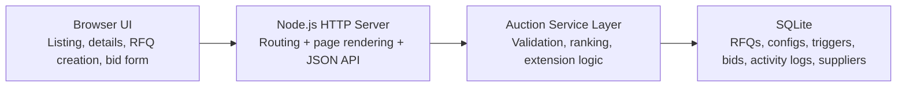
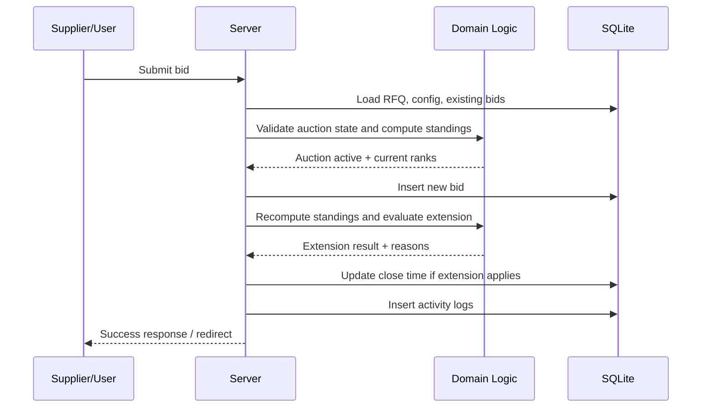

# British Auction RFQ System HLD

## Objective

Build a simplified RFQ platform that supports British Auction behavior:

- configurable extension triggers
- automatic close-time extension
- forced close protection
- transparent supplier standings
- auditable activity logs

## Architecture overview

## Main components

### 1. Presentation layer

- Server-rendered HTML pages for fast startup and easy reviewer testing
- Custom CSS for a polished listing/detail experience
- Small client-side enhancements for countdown timers and bid-total preview

### 2. API / controller layer

- Receives form submissions and JSON requests
- Parses payloads
- Redirects with user-friendly success/error messages for browser flows
- Returns structured JSON for backend evaluation

### 3. Domain layer

Encapsulates the critical auction logic:

- current auction status (`Scheduled`, `Active`, `Closed`, `Force Closed`)
- current supplier standings from latest bids
- rank-change detection
- lowest-bidder change detection
- extension evaluation
- forced-close capping

### 4. Persistence layer

SQLite stores:

- RFQ master data
- British Auction config
- trigger rules
- supplier master records
- bid history
- activity logs

## Core flow: bid submission

## Why this design works for the assignment

- It cleanly separates business rules from transport/UI.
- The ranking and extension logic are testable without the HTTP layer.
- SQLite makes the submission runnable on a local machine with almost zero setup.
- The activity log provides operational visibility, which is important for auction transparency.

## Important trade-offs

- Server-rendered pages were chosen over a heavier SPA stack to reduce setup friction.
- SQLite is ideal for an assignment/demo; in production, the same model could move to Postgres.
- The system is intentionally synchronous and simple because the assignment focuses on correctness and clarity more than scale engineering.

## Production evolution path

If this were taken beyond the assignment, the next steps would be:

1. Add authentication and role-based access for buyers and suppliers.
2. Move background-sensitive events to queued workflows and audit pipelines.
3. Use WebSockets or SSE for live auction updates.
4. Add optimistic locking for higher bid concurrency.
5. Introduce Postgres and migrations for multi-user production scale.
