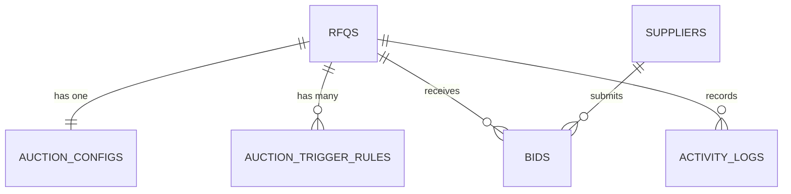

# Schema Design

## Overview

The schema is designed to support:

- RFQ lifecycle data
- British Auction configuration
- multiple extension triggers per RFQ
- supplier bid history
- current standings derived from latest supplier bids
- auditable activity logs

## Entity relationship diagram

## Tables

### `suppliers`

Stores supplier master data.

| Column | Type | Notes |
|---|---|---|
| `id` | integer PK | surrogate key |
| `code` | text unique | short supplier code |
| `name` | text | display / legal name |

### `rfqs`

Stores the RFQ and auction schedule.

| Column | Type | Notes |
|---|---|---|
| `id` | integer PK | surrogate key |
| `reference_id` | text unique | RFQ identifier visible to users |
| `name` | text | RFQ name |
| `mode` | text | `BRITISH_AUCTION` |
| `bid_start_at` | text | ISO datetime |
| `initial_bid_close_at` | text | original close time before any extension |
| `current_bid_close_at` | text | mutable close time after extensions |
| `forced_bid_close_at` | text | hard cap |
| `service_date` | text | date-only value |
| `created_at` | text | ISO datetime |

### `auction_configs`

Stores the numeric British Auction timing configuration.

| Column | Type | Notes |
|---|---|---|
| `id` | integer PK | surrogate key |
| `rfq_id` | integer FK unique | one config per RFQ |
| `trigger_window_minutes` | integer | `X` minutes |
| `extension_duration_minutes` | integer | `Y` minutes |
| `created_at` | text | ISO datetime |

### `auction_trigger_rules`

Stores one or more enabled extension triggers for a single RFQ.

| Column | Type | Notes |
|---|---|---|
| `id` | integer PK | surrogate key |
| `rfq_id` | integer FK | parent RFQ |
| `trigger_type` | text | `BID_RECEIVED`, `ANY_RANK_CHANGE`, `LOWEST_BIDDER_CHANGE` |
| `created_at` | text | ISO datetime |

### `bids`

Stores the full quote snapshot for every bid submission.

| Column | Type | Notes |
|---|---|---|
| `id` | integer PK | surrogate key |
| `rfq_id` | integer FK | target RFQ |
| `supplier_id` | integer FK | supplier placing the bid |
| `carrier_name` | text | carrier / quote label |
| `freight_charges` | real | monetary component |
| `origin_charges` | real | monetary component |
| `destination_charges` | real | monetary component |
| `transit_time_days` | integer | delivery estimate |
| `quote_valid_until` | text | date-only value |
| `total_amount` | real | derived total used for ranking |
| `created_at` | text | submission timestamp |

### `activity_logs`

Records operational events for transparency and auditability.

| Column | Type | Notes |
|---|---|---|
| `id` | integer PK | surrogate key |
| `rfq_id` | integer FK | target RFQ |
| `event_type` | text | `RFQ_CREATED`, `BID_SUBMITTED`, `TIME_EXTENDED` |
| `message` | text | human-readable explanation |
| `metadata_json` | text nullable | optional structured payload |
| `created_at` | text | event timestamp |

## Derived views in the application

These are computed at runtime instead of stored:

- current standings: latest bid per supplier, sorted by `total_amount`
- lowest bid / `L1` supplier
- auction status
- rank change and leader change across bid submissions

## Why this schema is a good fit

- It keeps historical bids intact instead of overwriting supplier quotes.
- It supports multiple trigger rules per RFQ without denormalizing them into a single text column.
- It preserves both original and current close times, which is essential for explaining extensions.
- It gives the UI enough detail to render audit-friendly logs and quote breakdowns.
